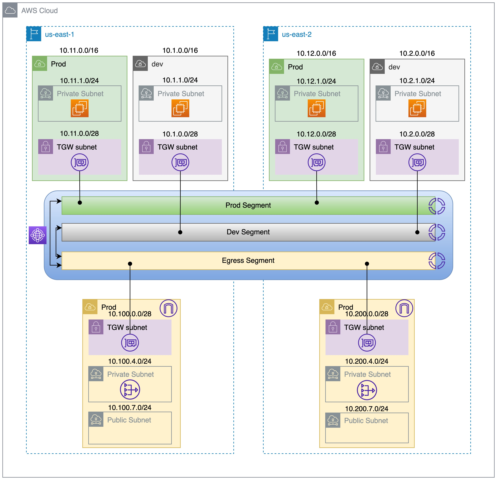

# terraform-aws-budget-mudule
This module will help you to create required resources for AWS Cloud WAN tutorial.
## East to West network Architecture

## North to South network Architecture

## Examples
Refer to the [examples](https://github.com/rajdeep617/terraform-aws-cloudwan-tutorial/tree/master/examples) directory in this GitHub repository for complete terraform code example.

## Known issues

No known issues.

## Requirements

| Name | Version  |
|------|----------|
|  [terraform](#requirement\_terraform) | >= 1.0.0 |
|  [aws](#requirement\_aws) | >= 3.29  |

## Authors
Module managed by [Rajdeep Hayer](https://github.com/rajdeep617).